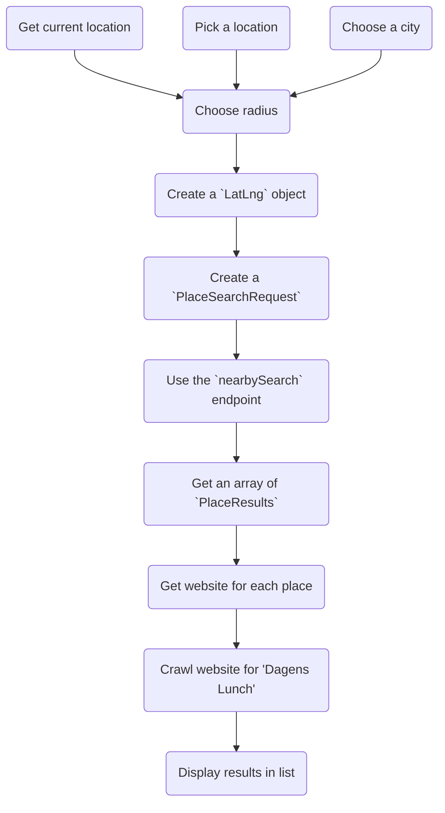

# Website project idea
A website to check for "Dagens lunch" (meal-of-the-day) for different restaurants near your location (in Sweden). This would be accomplished mainly through integrating with the Google Maps API.

> Tagline: "Vad blir det till lunch? 🍔"

It should be possible to do this using:
- (a) Your current location + a range
- (b) Pick a location on a map + a range
- (c) Maybe choosing like a city from a list?

The results would then be shown in a list, starting with the restaurants that are closest. 

Each item in the list should contain this information:
- The name of the restaurant
- The name and description of "Dagens lunch" (meal-of-the-day)
- Distance (in meters)
- Type of food/cuisine
- Address
- A link to the resturant website and/or menu
- Opening hours
- Rating
- Price level?

## Similar sites
### [lunchfindr.se](https://lunchfindr.se/)
- 🟢 Pros
  - Looks nice
  - Can use your position (Google Maps integration)
  - Displays "Dagens lunch" directly on the website
  - You can select the day of the week
- 🔴 Cons
  - It is NOT automatic but relies on manually adding restaurants and their menu

### [kvartersmenyn.se](https://www.kvartersmenyn.se/)
- 🟢 Pros
  - Displays "Dagens lunch" directly on the website
  - You can select the day of the week
- 🔴 Cons
  - You can only select the city from a list (it contains a map but you cannot search for nearby restaurants)
  - It is NOT automatic but relies on manually adding restaurants and their menu
  - Looks bad aesthetically

### [veckanslunch.se](https://veckanslunch.se/)
- 🟢 Pros
  - Looks nice(ish) aesthetically
- 🔴 Cons
  - It is NOT automatic but relies on manually adding restaurants and their menu
  - You can only select the city by searching for it (you cannot search for nearby restaurants)
     - The search also doesn't seem to work...?
  - Seems abandoned  

### [lunchguidensverige.se](https://lunchguidensverige.se/)
- 🟢 Pros
- 🔴 Cons

### [www.uppsalalunch.se](https://www.uppsalalunch.se/restauranger/)
- 🟢 Pros
- 🔴 Cons

## Rough idea on how it could work

1. (a) Get current location on Google Maps, convert to coordinates
1. (b) Pick a location on Google Maps, convert to coordinates
1. (c) Choose a city from a list, convert to coordinates
2. Choose radius distance (or fall back to a default value)
3. Create a [`LatLng` object](https://developers.google.com/maps/documentation/javascript/reference/coordinates#LatLng) from the coordinates
4. Create a [`PlaceSearchRequest`](https://developers.google.com/maps/documentation/javascript/reference/places-service#PlaceSearchRequest) w/ these properties:
    - `language`: "sv" ([supported languages](https://developers.google.com/maps/faq#languagesupport))
    - `location`: The `LatLng` object
    - `radius`: Radius (in meters)
    - `rankBy`: RankBy.DISTANCE (get closer places first)
    - `type`: "restaurant"
5. Use the Google Maps API [`nearbySearch`](https://developers.google.com/maps/documentation/javascript/reference/places-service#PlacesService.nearbySearch) endpoint and send the created `PlaceSearchRequest`
6. Get a response with a callback for getting an array of [`PlaceResult` objects](https://developers.google.com/maps/documentation/javascript/reference/places-service#PlaceResult)
7. For each PlaceResult, get the [`website`](https://developers.google.com/maps/documentation/javascript/reference/places-service#PlaceResult.website) property
8. Crawl the restaurant website and using some kind of reasonable algorithm, try to find if there is a "Dagens Lunch", get and save the data
9. Display the information (Dagens lunch, restaurant name, link, address, etc.) in a list on the website. Almost all this information can be taken from the `PlaceResult` object

### Regarding caching/saving data
- I should figure out how we can we cache/save data so that we can:
- (a) Not have to make the expensive Google Maps API request
- (b) Not have to do the resource intensive crawling of the restaurant websites
 
### Extra
- Give option to get directions directly to resturant:

https://developers.google.com/maps/documentation/api-picker

## Google Maps API documentation
### Getting started
- https://developers.google.com/maps/get-started
- [Tutorial for showing current location](https://developers.google.com/maps/documentation/javascript/geolocation)

### Relevant APIs and endpoints

https://developers.google.com/maps/documentation/api-picker

https://developers.google.com/maps/documentation/javascript/reference/places-service#PlacesService.nearbySearch

- [PlaceSearchRequest](https://developers.google.com/maps/documentation/javascript/reference/places-service#PlaceSearchRequest)
- [Place types](https://developers.google.com/maps/documentation/places/web-service/supported_types#table1) (restaurant)
- [Coordinates & the "LatLng" class](https://developers.google.com/maps/documentation/javascript/reference/coordinates#LatLng)
- [Current Place](https://developers.google.com/maps/documentation/places/android-sdk/current-place)

### How to calculate distance
- https://cloud.google.com/blog/products/maps-platform/how-calculate-distances-map-maps-javascript-api

### ⚠ Cost ⚠
Because the "nearbySearch" feature spans all 3 Places Data SKUs, the price per 1000 requests will be $40 (!!):
- Place - Nearby Search (price starting at 0.032 USD per call)
- Basic Data (billed at 0.00 USD)
- Contact Data (price starting at 0.003 USD per request)
- Atmosphere Data (price starting at 0.005 USD per request)

https://developers.google.com/maps/documentation/places/web-service/usage-and-billing#nearby-search

**This means that I can only make 5000 requests per month with the $200 of usage you get for free per month**

- https://mapsplatform.google.com/pricing/

https://developers.google.com/maps/documentation/places/web-service/usage-and-billing/#data-skus

## Domain name

- https://se.godaddy.com/domainsearch/find?domainToCheck=dagenslunch
